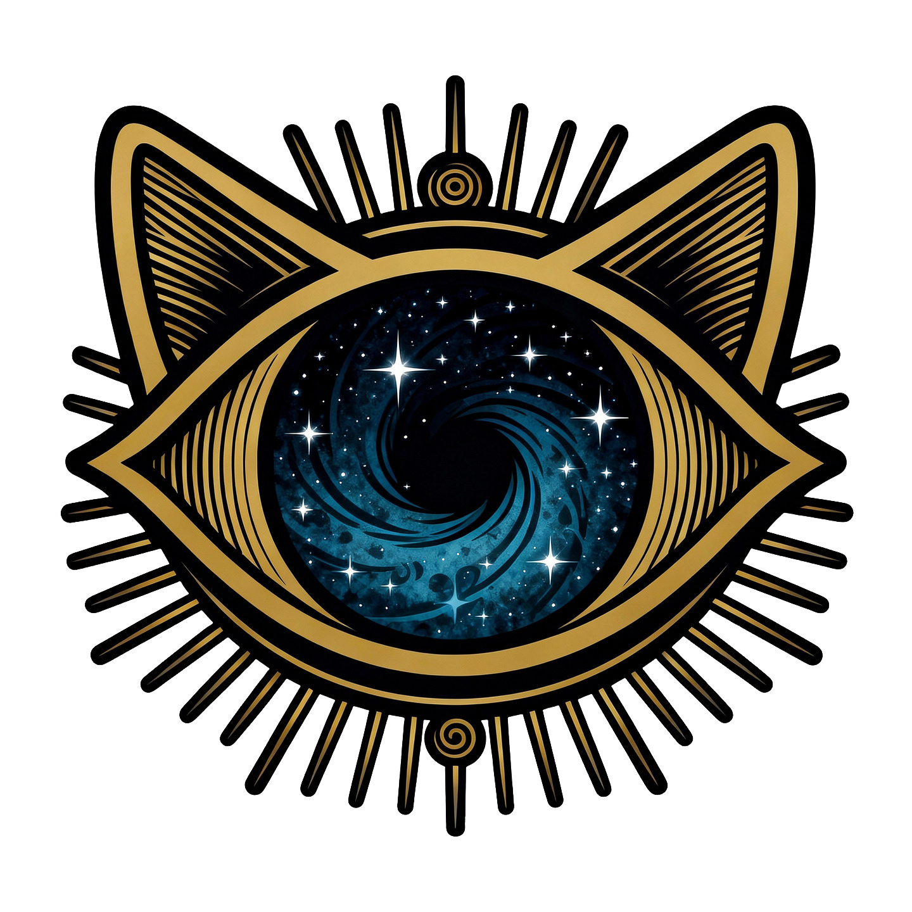

# Nine Lives Audio 🎧

> Because one life just isn't enough for your audiobook collection.

A beautiful, native Windows desktop client for [Audiobookshelf](https://www.audiobookshelf.org/). Built with WinUI 3 and .NET 10, Nine Lives brings your audiobook library to life with a cosmic dark theme, offline downloads, and seamless sync across all your devices.

[](https://github.com/StaticHumStudio/NineLivesAudio/releases/latest)
[](LICENSE)
[](https://dotnet.microsoft.com/download/dotnet/10.0)



---

## ✨ What Makes Nine Lives Different

- **🌌 Cosmic Dark Theme** - Beautiful dark UI with gold accents that's easy on the eyes during late-night listening sessions
- **📥 True Offline Support** - Download audiobooks and listen without internet. Your progress syncs automatically when you're back online
- **🎯 Smart Playback** - Seamlessly switches between local files and streaming. NAudio for downloaded content, MediaPlayer for streaming
- **⏱️ Sleep Timer** - Fall asleep to your favorite book with timers from 5 minutes to 2 hours
- **🔖 Bookmarks** - Mark your favorite moments, name them, and jump back anytime
- **🪟 Pop-Out Mini Player** - Keep playback controls floating above other windows while you work

---

## 🚀 Quick Start

### Installation

1. **Download the installer** from the [latest release](https://github.com/StaticHumStudio/NineLivesAudio/releases/latest)
2. **Run `NineLivesAudioSetup.exe`**

> ⚠️ **Windows SmartScreen Warning?** You'll likely see "Windows protected your PC" because this app uses a self-signed certificate. This is completely normal for open-source projects. Here's how to proceed safely:
>
> 1. Click **"More info"**
> 2. Verify the publisher shows **"Static Hum Studio"**
> 3. Click **"Run anyway"**
>
> *Why does this happen?* Microsoft only trusts expensive certificates from big companies ($300-500/year). As a free, open-source project, we use a self-signed certificate. You can verify the code is safe by reviewing the source yourself - everything's right here on GitHub!

3. **Launch Nine Lives Audio** from your Start Menu
4. **Connect to your Audiobookshelf server** in Settings
5. **Start listening!** 🎉

### First-Time Setup

1. Open Settings (gear icon)
2. Enter your Audiobookshelf server URL (e.g., `http://192.168.1.100:13378`)
3. Enter your username and password
4. Click "Test Connection"
5. Once connected, your library will sync automatically

---

## 🎵 Features

### Nine Lives Home Page
Your 9 most recently played audiobooks, front and center. Because cats have nine lives, and you have nine audiobooks fighting for your attention.

- Beautiful grid layout with cover art
- Progress bars so you know exactly where you left off
- One tap to jump back in

### Library Browser
- **Grid or list view** - Your choice
- **Search and filter** - Find that book you're thinking of
- **Multi-library support** - Separate your fiction from non-fiction
- **Downloaded badges** - See what's available offline at a glance
- **Connection indicator** - Always know if you're online or offline

### Player That Just Works
- **Chapter navigation** - Jump ahead or back through chapters
- **Playback speed control** - 0.5x to 3.0x (because sometimes you need to speed through that boring chapter)
- **Volume control** with mute detection
- **Sleep timer** - 5, 10, 15, 30, 45, 60, 90, or 120 minutes
- **Bookmarks** - Save your favorite quotes or important moments
- **Source awareness** - Shows whether you're playing from local storage or streaming
- **Lock screen controls** - Play/pause/skip from your lock screen

### Pop-Out Mini Player
Because you need to work AND listen.

- Compact 360×200 floating window
- Transport controls (skip back 10s, play/pause, skip forward 30s)
- Progress slider with time display
- Always-on-top toggle to keep it visible
- Auto-closes when you stop playback

### Downloads
- **Queue-based** - 2 concurrent downloads
- **Smart organization** - Saved to `Music/AudioBookshelf/Author - Title/`
- **Pause and resume** - Stop and start anytime
- **Auto-retry** - Up to 3 attempts with exponential backoff
- **Progress tracking** - Real-time percentage and byte count
- **Cover art downloads** - Optional automatic cover downloads
- **Cleanup** - Delete from the app to free up space

### Sync & Offline
Your audiobook life, everywhere you need it.

- **Auto-sync** - Configurable intervals (1-30 minutes)
- **Progress tracking** - Syncs every 12 seconds during playback
- **Offline queue** - Progress saves locally when you're offline, syncs when you're back
- **Smart recovery** - Scans your downloads and rebuilds metadata when needed
- **Manual sync** - Hit the button in Settings anytime

### Settings
- Server connection configuration
- Theme selection (System, Light, Dark)
- Default playback speed and volume
- Sync interval control
- Custom download path
- Start minimized / minimize to tray
- Self-signed certificate support
- Diagnostics logging

---

## 💻 Tech Stack

Built with modern Windows development tools:

- **UI Framework**: WinUI 3 / Windows App SDK 1.6
- **Runtime**: .NET 10
- **Architecture**: MVVM (CommunityToolkit.Mvvm)
- **Local Audio**: NAudio 2.2
- **Streaming**: Windows MediaPlayer
- **Database**: SQLite
- **Dependency Injection**: Microsoft.Extensions.DependencyInjection

---

## 🛠️ Building from Source

Want to hack on Nine Lives? Here's how:

### Prerequisites
- [.NET 10 SDK](https://dotnet.microsoft.com/download/dotnet/10.0)
- Windows 10 SDK (10.0.22621.0)
- Windows App SDK 1.6

### Build & Run
```bash
# Clone the repo
git clone https://github.com/StaticHumStudio/NineLivesAudio.git
cd NineLivesAudio

# Build
dotnet build -r win-x64

# Run
dotnet run -r win-x64
```

> **Note:** You'll see 69 MVVMTK0045 warnings during build. These are expected - they're AOT compatibility advisories from the MVVM toolkit that don't affect functionality.

### Quick Dev Workflow
```powershell
# Build, sign (dev cert), and run in one command
.\build-and-run.ps1
```

---

## 📁 Project Structure

```
NineLivesAudio/
  App.xaml(.cs)              # Application entry point and DI container
  MainWindow.xaml(.cs)       # Shell window with navigation frame
  Controls/
    BookCard.xaml(.cs)       # Reusable book cover card with hover overlay
    MiniPlayer.xaml(.cs)     # Compact playback bar (bottom of window)
  Data/
    LocalDatabase.cs         # SQLite persistence (books, progress, downloads)
    ILocalDatabase.cs        # Database interface
  Helpers/
    Converters.cs            # XAML value converters
    DownloadPathHelper.cs    # Shared download path and filename sanitization
    LegacyMigrationHelper.cs # One-time migration from legacy folder/vault names
  Models/
    AudioBook.cs             # Book model with chapters, audio files, progress
    DownloadItem.cs          # Download queue item with status and progress
    AppSettings.cs           # User preferences
    Library.cs               # Server library model
    Bookmark.cs              # Bookmark with timestamp
    ServerProfile.cs         # Server connection profile
    UserProgress.cs          # Progress sync DTO
  Resources/
    Styles.xaml              # Global styles and design tokens
    Converters.xaml          # XAML converter resources
  Services/
    AudioPlaybackService.cs  # NAudio + MediaPlayer dual-mode playback
    AudioBookshelfApiService.cs  # Audiobookshelf REST API client
    DownloadService.cs       # Queue-based file download engine
    SyncService.cs           # Library and progress synchronization
    PlaybackSourceResolver.cs    # Decides local vs. streaming playback
    SettingsService.cs       # Persistent app settings
    ConnectivityService.cs   # Network monitoring
    NavigationService.cs     # Frame navigation
    NotificationService.cs   # In-app toast notifications
    MetadataNormalizer.cs    # Title/author display formatting
    LoggingService.cs        # Diagnostic logging
    OfflineProgressQueue.cs  # Queued progress for offline sync
    AppInitializer.cs        # Startup orchestration
  ViewModels/
    HomeViewModel.cs         # Nine Lives data
    LibraryViewModel.cs      # Library browsing and filtering
    PlayerViewModel.cs       # Playback state and commands
    DownloadsViewModel.cs    # Download queue management
    MainViewModel.cs         # Shell and mini player state
    SettingsViewModel.cs     # Settings page logic
  Views/
    HomePage.xaml(.cs)       # Nine Lives recently played
    LibraryPage.xaml(.cs)    # Book browsing grid/list
    BookDetailPage.xaml(.cs) # Book info, chapters, actions
    PlayerPage.xaml(.cs)     # Full player with controls
    MiniPlayerWindow.xaml(.cs)  # Pop-out compact player window
    DownloadsPage.xaml(.cs)  # Download queue and completed list
    SettingsPage.xaml(.cs)   # App configuration
```

Clean MVVM architecture with dependency injection. Everything's wired up in `App.xaml.cs`.

---

## 🤝 Contributing

This is currently a private project, but if you're interested in contributing:

1. Fork the repo
2. Create a feature branch (`git checkout -b feature/amazing-feature`)
3. Commit your changes (`git commit -m 'Add some amazing feature'`)
4. Push to the branch (`git push origin feature/amazing-feature`)
5. Open a Pull Request

---

## 🐛 Known Issues

- **SmartScreen warnings**: Self-signed certificate triggers warnings (see installation notes above)
- **69 build warnings**: MVVM toolkit AOT compatibility advisories (non-blocking)

---

## 📋 Requirements

- **OS**: Windows 10 (version 1809 or later) or Windows 11
- **Server**: Audiobookshelf server instance (any version supporting API v1)
- **Storage**: ~60 MB for the app, plus space for downloaded audiobooks

---

## ❓ FAQ

**Q: Why is Windows blocking the installer?**
A: This app uses a self-signed certificate. See the installation instructions above for how to safely bypass this warning.

**Q: Can I use this without downloading audiobooks?**
A: Absolutely! Nine Lives works great for streaming-only. Downloads are completely optional.

**Q: Does this work with [other audiobook server]?**
A: No, Nine Lives is specifically designed for Audiobookshelf. It uses Audiobookshelf's REST API.

**Q: Will my progress sync with the mobile app?**
A: Yes! Nine Lives syncs progress with your Audiobookshelf server, so it works with any official or third-party client.

**Q: Can I use this on Mac or Linux?**
A: Not currently - Nine Lives uses WinUI 3, which is Windows-only. A cross-platform version would need to be rebuilt with MAUI or Avalonia.

---

## 🙏 Acknowledgments

- **Audiobookshelf** - Amazing open-source audiobook server
- **Microsoft** - WinUI 3 and Windows App SDK
- **NAudio** - Fantastic audio playback library
- **CommunityToolkit** - MVVM patterns made easy

---

## 📜 License

Private project by [Static Hum Studio](https://github.com/StaticHumStudio).

---

## 💬 Support

- 🐛 [Report a bug](https://github.com/StaticHumStudio/NineLivesAudio/issues)
- 💡 [Request a feature](https://github.com/StaticHumStudio/NineLivesAudio/issues)
- 📖 [View documentation](https://github.com/StaticHumStudio/NineLivesAudio/wiki)

---

<div align="center">

**Made with ❤️ by Static Hum Studio**

*Because every book deserves nine lives worth of listening.*

[Download Now](https://github.com/StaticHumStudio/NineLivesAudio/releases/latest) • [Report Issue](https://github.com/StaticHumStudio/NineLivesAudio/issues) • [View Source](https://github.com/StaticHumStudio/NineLivesAudio)

</div>

---

## Legal

Nine Lives Audio is a trademark of Static Hum Studio. All rights reserved.
See [TRADEMARK.md](./TRADEMARK.md) for full trademark notice.

© Static Hum Studio — [statichum.studio](https://statichum.studio)
